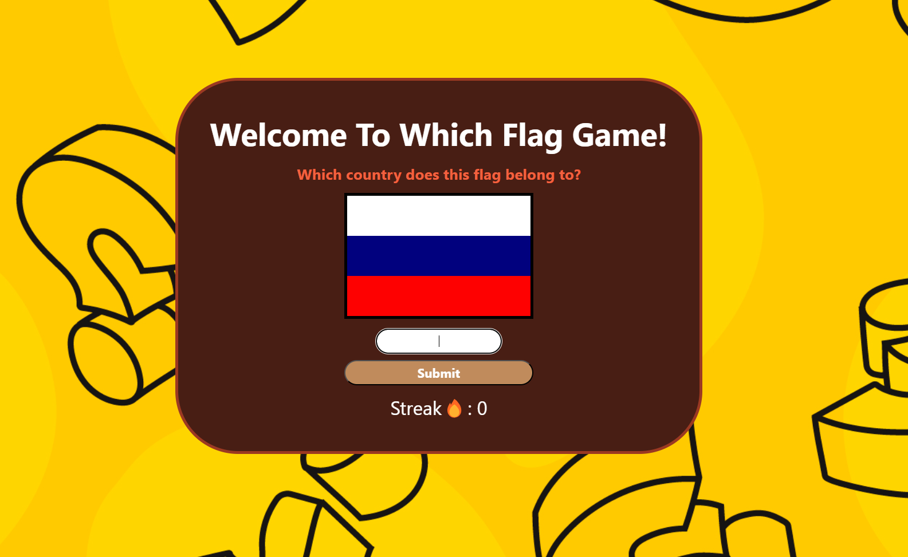

# Which Flag game!


# Which Flag Game

"Which Flag Game" is a web application that shows users random flags and asks them to guess which country the flag belongs to. The application provides a fun and educational experience.

## Table of Contents

- [Features](#features)
- [Installation](#installation)
- [Usage](#usage)
- [Contributing](#contributing)
- [License](#license)

## Features

- Fun game that displays random flags for users to guess.
- Interactive experience that helps users learn about flags.
- Back end developed using Node.js, Express.js, and PostgreSQL.
- User interface built with EJS (Embedded JavaScript) and CSS.
- Easy setup and usage.

## Installation

1. Clone the project to your local machine:

    ```bash
    git clone https://github.com/user/which-flag-game.git
    cd which-flag
    ```

2. Install the required packages:

    ```bash
    npm install
    ```

3. Configure your PostgreSQL database connection


4. Start the application:

    ```bash
    npm start
    ```

    The application will run at `http://localhost:3000` by default.

## Usage

- When the application starts, a random flag is displayed to the user.
- The user guesses which country the flag belongs to.
- The user enters their guess in the provided field and submits it.

## License

This project is licensed under the [MIT License](LICENSE). For more information, please refer to the license file.

